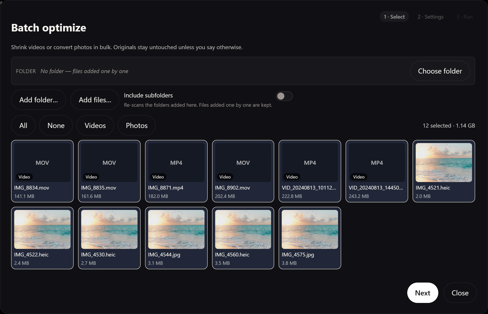
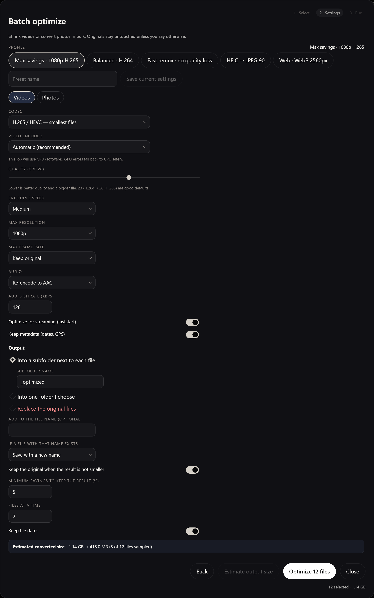
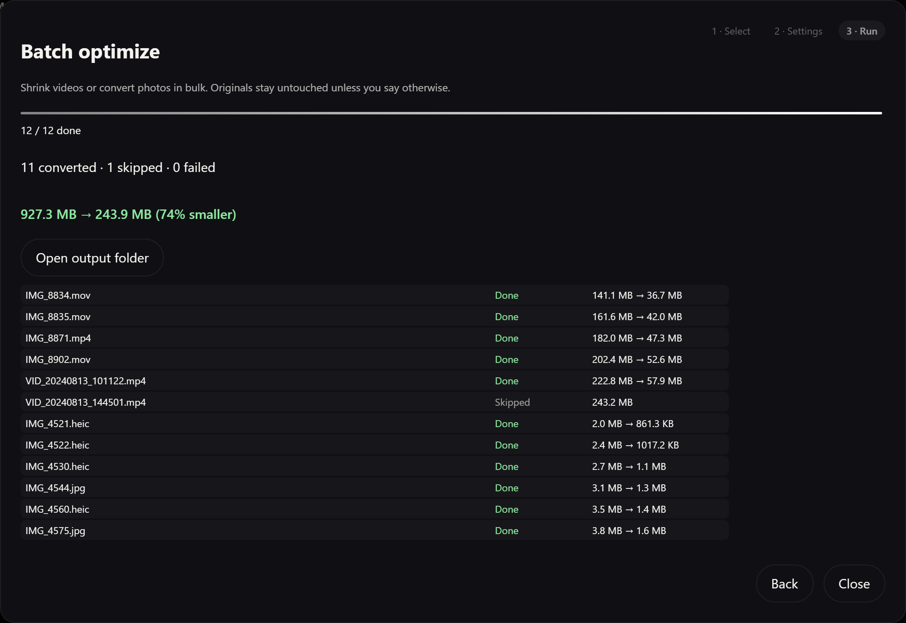

# Quick Media Organizer

**Organize thousands of phone photos and videos with your keyboard — no mouse required.**


[🇪🇸 Leer en español](README.es.md)

<p align="center">
  
</p>

---

## Why I built this

Honestly? **I needed it myself.**

I had a folder full of phone backups — thousands of `IMG_1234…` files mixed with videos — and every tool I tried felt slow, bloated, or wrong for the job. I didn't want a full photo library. I just wanted to **rename**, **sort into folders**, **trim the bad parts of videos**, and **move on** — as fast as possible, with my hands on the keyboard.

So I built **Quick Media Organizer**. It's not a startup pitch; it's a tool I use every day. I'm sharing it open source because I hope it helps someone else stuck with the same mess.

If it saves you time, I'd genuinely appreciate a [coffee ☕](https://buymeacoffee.com/ferran_vidal). It helps me keep improving it in my spare time.

---

## What it does

- **Rename** photos and videos in seconds with `Enter`
- **Move** files into subfolders like `gym/`, `trips/portugal/`, `paperwork/` with `Ctrl+F`
- **Trim videos losslessly** (FFmpeg stream copy — no re-encoding) before saving
- **Batch optimize** a whole folder: shrink videos to H.265/H.264/AV1 at the
  resolution you pick, or convert photos to JPEG/WebP/AVIF, into a new folder
- **Use the GPU automatically** for H.264/H.265/AV1 when FFmpeg and the device
  support NVENC, Quick Sync, AMF, VideoToolbox or VAAPI; failed GPU jobs retry
  safely on the CPU and record the fallback in the batch report
- **Estimate the converted size** from real three-second samples before starting
- **Resume an interrupted batch** after reopening the app; finished files stay
  finished and only pending files restart
- **Delete safely** to `_deleted/` inside your folder — never permanent, always undoable
- **Skip**, **navigate**, and **undo** without touching the mouse
- **Live Photos** (`.heic` + `.mov`) move, rename, and delete together
- Original **EXIF dates** and file timestamps are preserved — including
  through batch conversion, where the EXIF block is carried into the JPEG,
  PNG or WebP that comes out
- **Updates itself** from this repository's releases, with the release notes
  shown before you install

<p align="center">
  
</p>

<p align="center">
  
</p>

<p align="center">
  
</p>

<p align="center">
  
</p>

<p align="center">
  
</p>

---

## Download

Get the latest release for your platform:

**[GitHub Releases →](../../releases)**

macOS (`.dmg`) · Windows (`.msi` / `.exe`)

### First launch (unsigned builds)

| OS | What you may see | What to do |
|----|------------------|------------|
| **macOS** | "Unidentified developer" | Right-click the app → **Open** → confirm once |
| **Windows** | SmartScreen warning | Click **More info** → **Run anyway** |

---

## Keyboard shortcuts

| Key | Action |
|-----|--------|
| `Enter` | Rename or save to armed folder *(also applies pending video trim)* |
| `Ctrl+F` / `⌘F` | Choose or create a subfolder |
| `Ctrl+D` / `⌘D` | Move to `_deleted/` *(works while typing)* |
| `Delete` | Move to `_deleted/` *(when not typing)* |
| `⌘⇧Space` / `Ctrl+Space` | Skip |
| `←` `→` | Previous / next |
| `Ctrl+Z` / `⌘Z` | Undo |
| `Ctrl+M` / `⌘M` | Toggle metadata |
| `Ctrl+B` / `⌘B` | Batch optimize |
| `Ctrl+O` / `⌘O` | Options |
| `?` | Help |
| `[` `]` | Set video trim start / end |
| `Esc` | Cancel armed folder / close modal |

Shortcuts stay **always visible** in the bottom bar.

---

## FAQ

**Does Delete erase files forever?**  
No. Files go to `_deleted/` inside your media folder. Review them anytime.

**Will organizing change capture dates?**  
No. Renaming and moving never touch the file's contents. Batch conversion
re-encodes the image, so the EXIF block is copied across explicitly — that
works for JPEG, PNG and WebP output. AVIF has nowhere to put it, and the
settings panel says so before you start.

**Videos and Live Photos?**  
Yes. Videos preview in-app and can be trimmed losslessly. Live Photo pairs stay in sync.

**HEIC on Windows?**  
Organizing works. Preview may fall back to metadata on some setups.

**What happens if the app closes during a batch?**

The app checkpoints every completed file. On the next launch it keeps those
results, removes any incomplete temporary output and resumes the pending files.

**Standard or Lite download?**  
Every release ships both:

| | Size (Windows setup) | FFmpeg |
|---|---|---|
| Standard | ~57 MB | included, nothing to install |
| Lite (`-lite`) | ~5 MB | you install it yourself |

Renaming and organizing work in both. Trimming and batch optimizing need
FFmpeg, so on Lite install it once with `winget install Gyan.FFmpeg` (Windows),
`brew install ffmpeg` (macOS) or `apt install ffmpeg` (Linux), then reopen the
app. A bundled copy always wins over one found on your PATH, since it is the
build the app was tested against.

Building locally: `pnpm build` produces the Lite installer, `pnpm build:full`
downloads FFmpeg and produces the Standard one.

FFmpeg is GPL-licensed and stays a separate program, invoked as a subprocess;
this app remains MIT. `FFMPEG-LICENSE.txt` travels with the Standard
installer.

---

### In-app updates on a fork

Nothing in the app points at a fixed repository: the update endpoint is written
at build time from `GITHUB_REPOSITORY` (or the `origin` remote when building
locally), so a fork updates from its own releases.

To enable it, generate a signing key pair once and add three repository
secrets:

```bash
pnpm tauri signer generate -w .tauri/qmo.key
```

| Secret | Value |
|---|---|
| `TAURI_SIGNING_PRIVATE_KEY` | contents of `.tauri/qmo.key` |
| `TAURI_SIGNING_PRIVATE_KEY_PASSWORD` | the password you chose |
| `TAURI_SIGNING_PUBLIC_KEY` | contents of `.tauri/qmo.key.pub` |

Then push a tag. Releases without those secrets still build and publish — they
just ship without the in-app updater.

---

## Build from source

Requirements: [Node.js](https://nodejs.org/) 20+, [Rust](https://rustup.rs/),
[pnpm](https://pnpm.io/) (`corepack enable`)

```bash
git clone https://github.com/AlexAdiaconitei/quick-media-organizer.git
cd quick-media-organizer
pnpm install
pnpm dev            # starts the desktop app
```

| Command | What it does |
|---|---|
| `pnpm dev` | Runs the desktop app (Tauri + Vite) |
| `pnpm dev:web` | Frontend only, in a browser — no IPC, most actions are inert |
| `pnpm check` | Svelte and TypeScript check |
| `pnpm build` | Lite installer, without FFmpeg |
| `pnpm build:full` | Downloads FFmpeg and builds the standard installer |
| `pnpm fetch-ffmpeg` | Only fetches FFmpeg into `src-tauri/binaries` |
| `cargo test` (in `src-tauri`) | Rust tests; the FFmpeg ones skip themselves if it is missing |

---

## Support & contact

This is a personal passion project born from a real need. If you find it useful:

- ☕ **[Buy me a coffee](https://buymeacoffee.com/ferran_vidal)** — helps me maintain and improve it
- ✉️ **Email:** [ferranvidaldev@gmail.com](mailto:ferranvidaldev@gmail.com)
- 💼 **LinkedIn:** [ferran-vidal-belles](https://www.linkedin.com/in/ferran-vidal-belles/)

Issues and PRs welcome on GitHub. I can't promise instant support, but I read everything.

---

## License

MIT — see [LICENSE](LICENSE).

**Author:** [Ferran Vidal Bellés](https://github.com/FerranVidalBelles)
